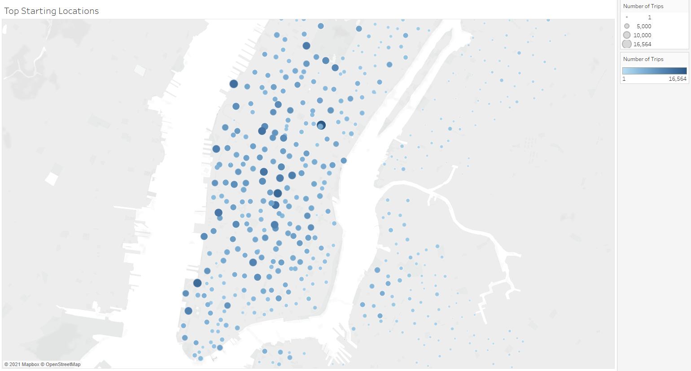
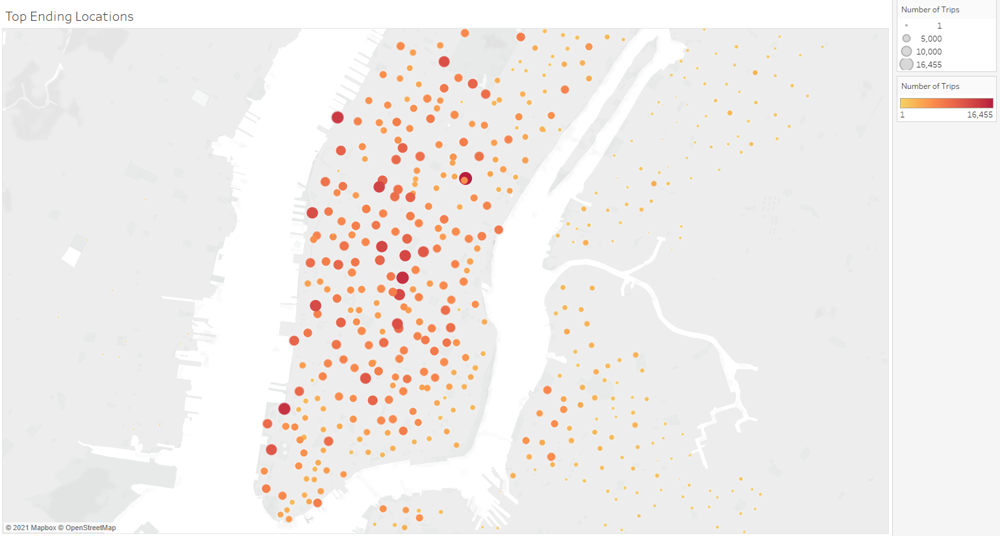
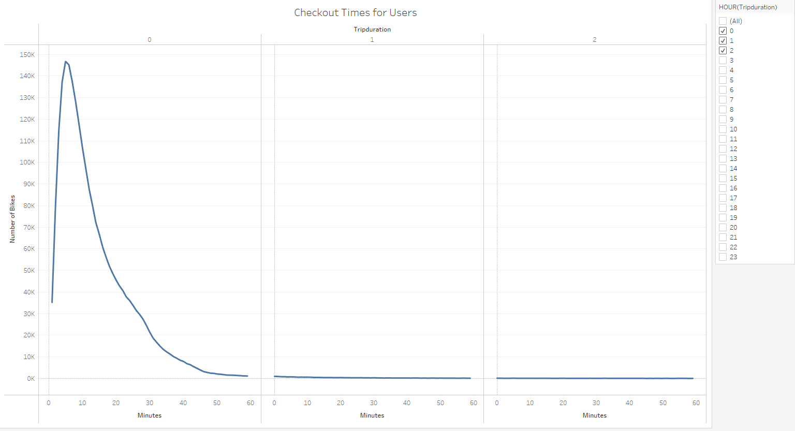
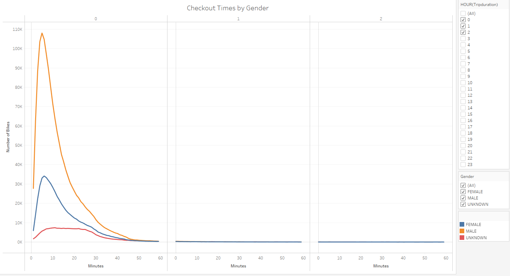
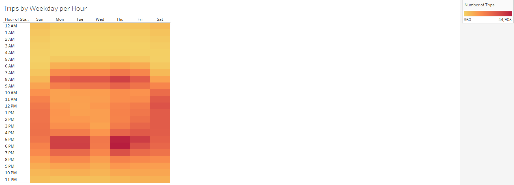
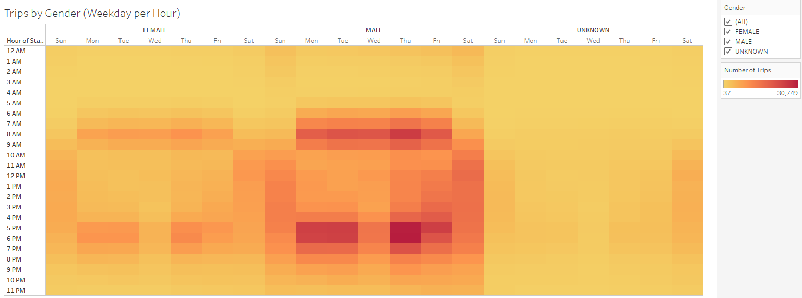
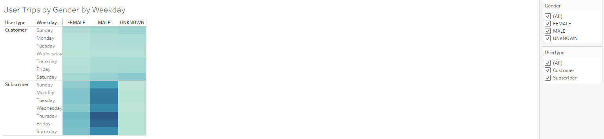

# Bike Sharing

## Overview of Analysis

### Purpose

After visiting NYC and using citibikes to get around, an idea forms to start a similar business in Des Moines. In order to impress potential investors and show how the program might work in a different city, I will be using Tableau to create visualizations to explore and analyze the NYC bike sharing data from August 2019. 

## Results

My Tableau Public story can be viewed [here](https://public.tableau.com/app/profile/briana.brown7509/viz/NYCCitibike_16384730806450/NYCCitibikeStory). 

### Top Starting Locations

Bike stations in Manhattan might be a more popular place to start a trip because of more tourists here.

### Top Ending Locations

The most popular drop off locations appear to be in the same places as the most popular starting locations.

### Checkout Times for Users

Bikes are usually checked out for less than an hour, and most commonly they are only checked out for five minutes.

### Checkout Times by Gender

Males are overwhelmingly the primary bike users compared to females.

### Trips by Weekday per Hour

The most popular times for bike trips are weekdays during commuting hours, followed by weekends.

### Trips by Gender (Weekday per Hour)

Males use the bikes the most during weekday commuting hours and are also the more frequent user on weekends.

### User Trips by Gender by Weekday

Male subscribers are by far the primary users for citibikes each day of the week.

## Summary

Based on the NYC bike trip analysis, it appears a bike sharing program could work in a different city by targeting male commuters as the primary customers on a subscription basis.

### Additional Visualizations

There are some additional visualizations that I would perform with the given dataset for future analysis. First, I would look at the number of trips by birth year and gender to get a sense of the ages of the primary users. Second, I would look at the average trip duration by user type and gender to see if there is a difference in how long separate groups of users tend to checkout bikes.
